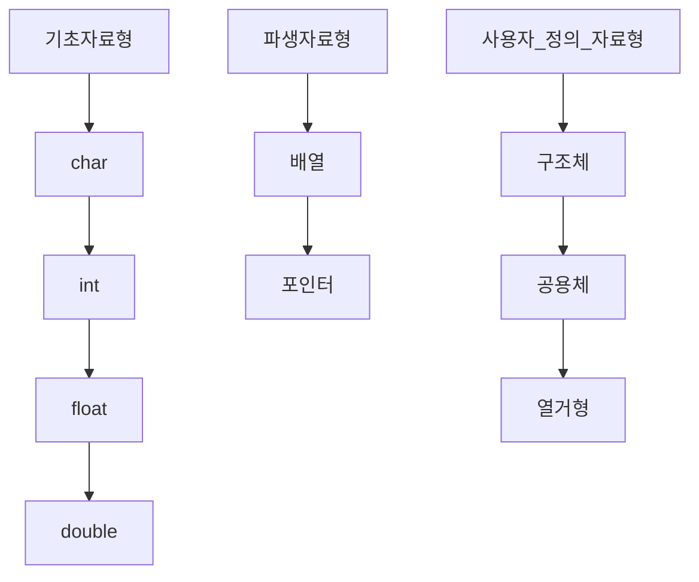

# 자료구조

자료구조란? 

**자료를 효율적으로 사용하기 위해 자료의 특성에 따라 분류하고 구성하며 저장 및 처리하는 모든 작업**

---

자연어

사람 ↔ 사람의 의사소통 수단

프로그래밍 언어 

사람 ↔ 컴퓨터의 의사소통 수단 

프로그램 - 명령문의 집합

**프로그램 개발 과정**

1. 문제 요구 사항을 정확히 기술
2. 문제 분석
3. 알고리즘 작성
4. 프로그램 작성
5. 프로그램 테스트 및 검증

**자료구조** 

1. Queue → 명령을 순서대로 처리함 **[프린트와 같은 예시]**
2. Stack
3. tree
4. List
5. Array

---

**1장. 자료구조와 알고리즘**

프로그램 = 자료구조 + 알고리즘

```
자료구조 -> 배열과 같은 저장소, 변수의 선언 [ 자료를 어떻게 구조화 시킬것인지 ? ]
알고리즘 -> 자료구조를 사용하여 어떤 절차로 목표를 달성시킬것인지?
        -> 컴퓨터로 문제를 풀기위한 단계의 절차
```

---

알고리즘의 조건

1. 입력 : 0개 이상의 입력이 존재해야 한다.
2. 출력 : 1개 이상의 출력이 존재하여야 한다.
3. 명백성 : 각 명령어의 의미는 모호하지 않고 명확해야 한다.
4. 유한성 : 한정된 수의 단계 후에는 반드시 종료되어야 한다.
5. 유효성 :각 명령어들은 실행 가능한 연산이어야 한다.
    
    ---
    

알고리즘의 기술 방법

1. 자연어
2. 흐름도 → flowChart
3. 의사코드 → 알고리즘에서 가장 많이 사용
4. 프로그래밍 언어

데이터의 종류(Data type)

1. 기초 자료형
2. 파생 자료형
3. 사용자 정의 자료형



자료형 → 데이터의 집합과 연산의 집합

추상 데이터 타입 → 생각나야하는것, CLASS

1. 데이터나 연산이 **‘무엇’** 인가는 정의되지만 데이터나 연산을 ‘**어떻게’** 컴퓨터 상에 구현할 것인지는 정의되지 않는다. **** 

객체 : 추상 데이터 타입에 속하는 객체가 정의된다.

연산 : 객체들 사이의 연산이 정의 → 연산은 추상 데이터 타입과 외부를 연결하는 인터페이스 역할

복잡도의 두가지 → 시간복잡도 , 공간복잡도 

시간복잡도는 알고리즘을 이루고 있는 연산들이 몇번이나 수행되는지를 숫자로 표시 

**빅오 표기법 →** n(O)  표기법

---

$$
n^2+n+1
$$

O = 1000인경우 n^2은 100만이 나오고 n+1은 1001이 나오기때문에, **전체 계산의 n^2 은 전체 계산의 99,9%,** 그 나머지가 0.1%를 차지 한다는것을 유추 할 수 있다.

자료의 개수가 **많은 경우에는 차수가 가장 큰 항이 가장 영향**을 크게 미치고 다른 항들은 비교적 무시될 수 있다.

→ **빅오표기법은 대략적으로만 표현한다는게 Point**

**순환**

---

알고리즘이나 함수가 실행 중에 자기 자신을 다시 호출하여 문제를 해결하는 기법

순환적으로 정의된 문제를 해결할 때 적합한 방법이다

순환과 반복의 시간 복잡도가 동일하다고 가정할 때, 반복이 더 **효율**적이다